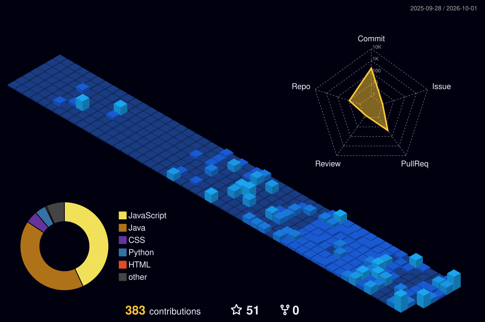

## About Me

## Technology Ecosystem

## Developer Identity Dashboard

## Featured Projects

| Project | Description | Technology | Links |
|---|---|---|---|
| **CodeXLive** | AI code review and real-time collaboration | MERN, Socket.io, Yjs, AI | [GitHub](https://github.com/Riteshmaurya07/Code_X_Live) · [Live](https://codexlive-three.vercel.app/) |
| **Matty** | Interactive graphic design and whiteboarding | React, MongoDB, Cloudinary | [Live](https://matty-graphic-design-tool.vercel.app/) |
| **DocChat** | AI-powered document Q&A | MERN, Gemini API | [GitHub](https://github.com/Riteshmaurya07/DocChat) |
| **CipherSQLStudio** | Secure SQL workspace with AI-assisted hints | React, Node.js, PostgreSQL | [GitHub](https://github.com/Riteshmaurya07/CipherSQLStudio) · [Live](https://cipher-sql-studio-seven.vercel.app/) |

## Coding Achievements

- **800+** DSA problems solved across coding platforms
- LeetCode **500 Days** and **365 Days** badges
- **25+** coding contests participated in
- B.Tech in Computer Science and Engineering — Chhatrapati Shahu Ji Maharaj University, 2026 · **8.52 CGPA**

## GitHub Analytics

## 3D GitHub Contributions

  

## Coding Profiles

| Platform | Profile |
|---|---|
| LeetCode | [riteshmaurya07](https://leetcode.com/riteshmaurya07) |
| CodeChef | [riteshmaurya07](https://www.codechef.com/users/riteshmaurya07) |
| GeeksforGeeks | [riteshmaujt7x](https://www.geeksforgeeks.org/user/riteshmaujt7x/) |
| Codolio | [riteshmaurya07](https://codolio.com/profile/riteshmaurya07) |
| GitHub | [Riteshmaurya07](https://github.com/Riteshmaurya07) |

## Current Focus

- AI-powered developer tools and LLM integration
- Generative AI and practical AI applications
- Cloud technologies and system design
- Open source contributions

## Connect With Me

**Code. Build. Innovate. Repeat.**

Explore my repositories, and if you find something useful, consider leaving a star.

